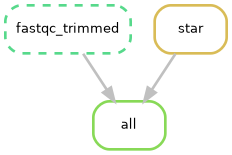

# Workflow Automation with Snakemake – RNA-seq Alignment


---

# Project Overview

This project presents a reproducible **RNA-seq workflow automation pipeline using Snakemake**.

The project demonstrates how a command-line RNA-seq alignment workflow can be converted into a dependency-aware and reproducible workflow using **Snakemake**, with **HISAT2** for read alignment and **SAMtools** for BAM sorting and indexing.

The workflow uses paired-end RNA-seq reads that were previously quality-controlled and trimmed using **FastQC** and **fastp**.

The main objective was to automate the alignment stage and generate a valid, sorted and indexed BAM file suitable for downstream RNA-seq analysis.

---

# Biological / Computational Objective

> **To develop a reproducible Snakemake workflow for automated alignment of paired-end RNA-seq reads to the human GRCh38 reference genome and generation of a sorted and indexed BAM file.**

The project focuses on workflow automation rather than downstream differential expression analysis.

---

# Workflow

```text
Paired-end trimmed FASTQ
          │
          ▼
       HISAT2
          │
          ▼
     SAM output
          │
          ▼
    SAMtools sort
          │
          ▼
 Sorted BAM file
          │
          ▼
   SAMtools index
          │
          ▼
   BAM + BAI index
```

The workflow is controlled by **Snakemake**, which automatically determines dependencies between individual processing steps.

---

# Upstream RNA-seq Processing

The input data used by the workflow were previously processed using standard RNA-seq quality-control and preprocessing steps.

```text
Raw FASTQ
   │
   ▼
 FastQC
   │
   ▼
  fastp
   │
   ▼
Trimmed FASTQ
   │
   ▼
Snakemake workflow
   │
   ▼
HISAT2
   │
   ▼
SAMtools
```

The trimmed paired-end FASTQ files are used as input to the Snakemake alignment workflow.

---

# Dataset

The workflow uses paired-end human RNA-seq data.

| Information | Value |
|-------------|-------|
| Organism | *Homo sapiens* |
| Genome | GRCh38 |
| Data type | Bulk RNA-seq |
| Sequencing | Paired-end |
| Input | Trimmed FASTQ |
| Alignment tool | HISAT2 |
| BAM processing | SAMtools |
| Workflow manager | Snakemake |
| Operating system | Linux / WSL2 |

The large sequencing files and reference resources are **not included in the GitHub repository**.

---

# Reference Genome

The alignment was performed against the **human GRCh38 reference genome**.

A pre-built HISAT2 GRCh38 index was used instead of rebuilding the index locally.

The HISAT2 index contains:

```text
genome/hisat2_index/grch38/
├── genome.1.ht2
├── genome.2.ht2
├── genome.3.ht2
├── genome.4.ht2
├── genome.5.ht2
├── genome.6.ht2
├── genome.7.ht2
└── genome.8.ht2
```

The complete reference genome and HISAT2 index are not tracked by Git because of their large file size.

---

# Snakemake Workflow

The workflow is defined in:

```text
Snakefile
```

The number of computational threads is controlled through:

```text
config.yaml
```

Example configuration:

```yaml
threads: 4
```

---

# Pipeline Steps

## 1. HISAT2 Alignment

Paired-end trimmed FASTQ files are aligned to the GRCh38 genome using HISAT2.

The workflow uses:

```bash
hisat2     -p {threads}     -x genome/hisat2_index/grch38/genome     -1 data/trimmed/sample_R1_trimmed.fastq     -2 data/trimmed/sample_R2_trimmed.fastq
```

The alignment output is directly passed to `samtools sort`.

This avoids storing an intermediate SAM file as a separate final output.

---

## 2. SAMtools Sorting

The HISAT2 output is piped directly into:

```bash
samtools sort
```

The resulting BAM file is sorted by genomic coordinates.

Output:

```text
results/hisat2/sample_Aligned.sortedByCoord.out.bam
```

---

## 3. SAMtools Indexing

The sorted BAM file is indexed using:

```bash
samtools index
```

Output:

```text
results/hisat2/sample_Aligned.sortedByCoord.out.bam.bai
```

---

# Workflow Validation

The completed workflow was tested using Snakemake dry-run mode:

```bash
snakemake -n
```

After successful execution, Snakemake reported:

```text
Nothing to be done (all requested files are present and up to date).
```

This confirms that all declared workflow outputs were present and up to date.

---

# Alignment Results

The final alignment produced:

```text
67,567,383 total alignments
56,998,082 primary alignments
66,618,668 mapped reads
```

The overall primary alignment rate was:

**98.34%**

Properly paired reads:

**96.27%**

Additional alignment statistics:

| Metric | Result |
|--------|--------|
| Total reads | 56,998,082 primary |
| Primary mapped | 56,049,367 |
| Primary mapping rate | 98.34% |
| Properly paired | 54,871,736 |
| Properly paired rate | 96.27% |
| Singletons | 765,851 |
| Supplementary alignments | 0 |
| Duplicates | 0 |

The alignment statistics were obtained using:

```bash
samtools flagstat
```

---

# BAM Validation

The final BAM file was checked using:

```bash
samtools quickcheck -v results/hisat2/sample_Aligned.sortedByCoord.out.bam
```

The command returned no errors, confirming that the BAM file passed the integrity check.

The final output consists of:

```text
sample_Aligned.sortedByCoord.out.bam
sample_Aligned.sortedByCoord.out.bam.bai
sample_Log.final.out
```

The BAM file is approximately **1.9 GB** and the BAM index approximately **3.1 MB**.

Large BAM files are intentionally excluded from the GitHub repository.

---

# Workflow Visualization

The Snakemake dependency graph is stored in:

```text
figures/workflow_dag.png
```

### Workflow DAG



---

# Project Structure

```text
05-Workflow-Automation-Snakemake/
│
├── Snakefile
├── config.yaml
├── .gitignore
├── README.md
│
├── figures/
│   └── workflow_dag.png
│
├── data/
│   ├── raw/
│   └── trimmed/
│
├── genome/
│   └── hisat2_index/
│
├── results/
│   ├── fastp/
│   │   ├── fastp_report.html
│   │   └── fastp_report.json
│   │
│   └── hisat2/
│       └── sample_Log.final.out
│
└── docs/
```

Large sequencing files, BAM files and genome index files are excluded from version control using `.gitignore`.

---

# Requirements

The workflow was developed and tested under **Linux / WSL2**.

Required tools:

- Snakemake
- HISAT2
- SAMtools
- Graphviz

Upstream preprocessing used:

- FastQC
- fastp

---

# Installation

Clone the repository:

```bash
git clone <repository_url>
cd 05-Workflow-Automation-Snakemake
```

Verify the installations:

```bash
snakemake --version
hisat2 --version
samtools --version
dot -V
```

---

# Configuration

The workflow uses:

```text
config.yaml
```

Current configuration:

```yaml
threads: 4
```

The value is used by Snakemake to control the number of computational threads assigned to HISAT2 and SAMtools.

---

# Running the Workflow

After placing the required trimmed paired-end FASTQ files and HISAT2 GRCh38 index in the expected locations, perform a dry run first:

```bash
snakemake -n
```

To display the commands that will be executed:

```bash
snakemake -n -p --cores 4
```

Run the complete workflow:

```bash
snakemake --cores 4 --rerun-incomplete --printshellcmds
```

---

# Reproducibility

The workflow is implemented using **Snakemake**, which explicitly defines:

- input files,
- output files,
- dependencies,
- computational resources,
- execution commands.

This makes the alignment workflow reproducible and allows Snakemake to determine which steps need to be executed.

For example, after successful completion:

```bash
snakemake -n
```

returns:

```text
Nothing to be done (all requested files are present and up to date).
```

If an output file is missing, Snakemake automatically identifies the corresponding rule that needs to be executed.

---

# Tools Used

| Tool | Purpose |
|------|---------|
| Snakemake | Workflow automation and dependency management |
| HISAT2 | RNA-seq read alignment |
| SAMtools | BAM conversion, sorting, indexing and QC |
| FastQC | Raw and trimmed read quality assessment |
| fastp | Adapter trimming and read preprocessing |
| Graphviz | Workflow DAG visualization |
| GRCh38 | Human reference genome |
| Linux / WSL2 | Computational environment |

---

# Skills Demonstrated

This project demonstrates practical experience with:

- RNA-seq data processing
- NGS workflow design
- Snakemake
- Workflow automation
- Dependency management
- HISAT2
- RNA-seq genome alignment
- SAMtools
- BAM processing
- BAM indexing
- Alignment QC
- Paired-end sequencing data
- GRCh38 reference genome
- Linux command line
- WSL2
- YAML configuration
- Workflow visualization
- Graphviz
- Reproducible bioinformatics workflows
- Git & GitHub project organization

---

# Main Results

The workflow successfully processed paired-end RNA-seq data and generated a valid sorted and indexed BAM file.

Key results:

```text
Overall alignment rate:      98.34%
Properly paired:             96.27%
Primary mapped reads:        98.34%
BAM integrity check:         PASS
Snakemake workflow status:   Complete
```

The final BAM file passed `samtools quickcheck` without errors.

---

# Limitations

The complete raw and intermediate sequencing data are not included in this repository because of their large file size.

The repository therefore contains the workflow definition, configuration, representative reports, workflow visualization and alignment log, while large computational resources remain outside Git version control.

The current workflow focuses on the alignment and BAM-processing stage.

Downstream analyses such as:

- transcript quantification,
- gene-level counting,
- differential expression analysis,
- transcript assembly,

are outside the scope of this project.

---

# Future Improvements

Possible extensions of this project include:

- Support for multiple samples
- Sample configuration through a YAML file
- Automatic FastQC and fastp integration
- MultiQC reporting
- Gene-level quantification using featureCounts
- Salmon-based transcript quantification
- Automated reference/index preparation
- Containerization using Docker or Singularity
- Conda environment management
- Cluster/HPC execution
- Automatic resource management
- Multi-sample RNA-seq workflow
- Integration with downstream differential expression analysis

---

# Author

**Katarzyna Zielińska**

Bioinformatics Portfolio

2026

Created as part of a Bioinformatics Portfolio project focused on reproducible RNA-seq workflow automation using Snakemake, HISAT2 and SAMtools.
